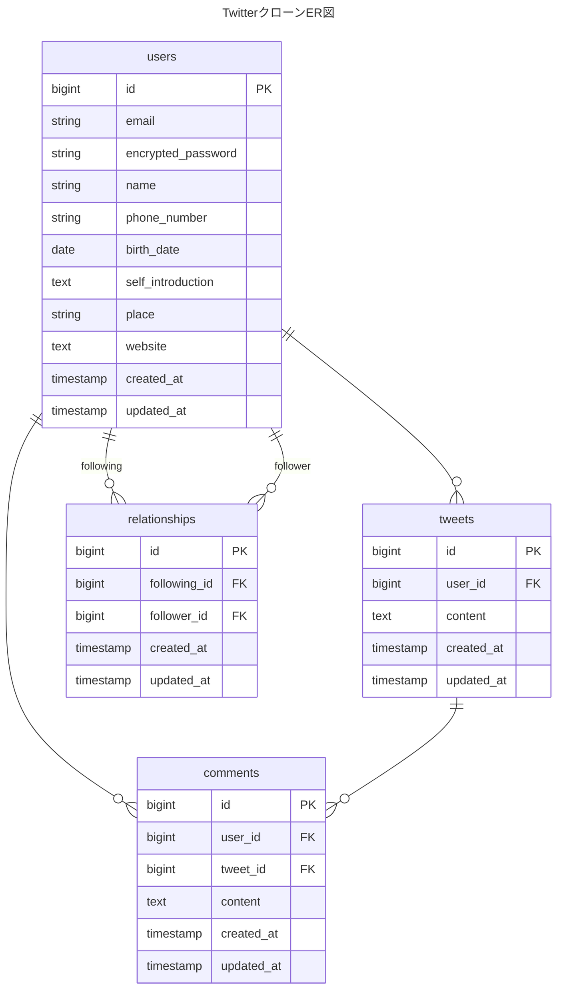

## 概要
本リポジトリは、Ruby on Rails を用いて開発した Twitter クローンアプリです。
ユーザー認証、ツイート投稿、ダイレクトメッセージ、通知機能など、
SNS に必要な主要機能を実装し、設計から開発まで行いました。

## 使用技術
- Ruby 3.2.1
- Rails 7.0.0
- PostgreSQL 14
- Bootstrap
- 開発環境：Docker
- 本番環境：Heroku
- 画像保存：Amazon S3

## 機能一覧
- サインアップ・ログイン(devise, github認証)
- プロフィール閲覧・編集
- ツイート機能(テキスト&画像)
- いいね
- リツイート
- フォロー
- コメント
- ブックマーク
- メッセージ機能(DM)
- 通知機能

## ER図(作成中)

## 画面イメージ

